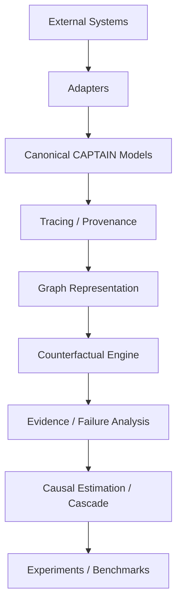

# CAPTAIN / CELA System Overview

## High-Level System
The system comprises the CAPTAIN platform (infrastructure) and the CELA (Counterfactual Evidence-Flow Analysis) method (research layer).

## Architectural Layers (A-G)
1. **Layer A — Agent Execution**: Modular reference agent with planner, reasoner, working memory, tool system, LLM provider abstraction, and response generator.
2. **Layer B — Observation**: Execution trace collector and multimodal provenance extractor.
3. **Layer C — Representation**: Execution graph builder, graph validation, graph analysis.
4. **Layer D — Counterfactual Analysis**: Intervention model, counterfactual replay engine.
5. **Layer E — Evidence & Failure Analysis**: Evidence identity/lineage, failure model, causal estimation, cascade prevention.
6. **Layer F — Research Evaluation**: Benchmarks, baselines, oracle, benchmark runner, statistical validation, experiment runner.
7. **Layer G — Presentation**: Trace explorer, benchmark demo, experiment runner, result visualization, reproducible demo.

## Module Dependency Graph

