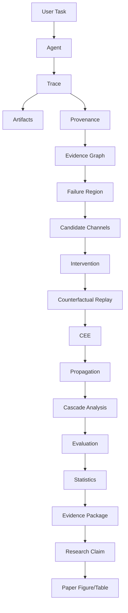

# CAPTAIN/CELA — Project Map

## Conceptual Flow

## Module Mapping

- `captain.agent`: User Task, Agent
- `captain.core.trace`: Trace, Artifacts
- `captain.provenance`: Provenance, Evidence Graph
- `cela.failure_analysis`: Failure Region, Candidate Channels
- `cela.intervention`: Intervention, Counterfactual Replay
- `cela.estimation`: CEE, Propagation, Cascade Analysis
- `cela.evaluation`: Evaluation, Statistics
- `cela.reporting`: Evidence Package, Research Claim, Paper Figure/Table

## Data Flow

1. **User Task & Agent State** (`TaskDef`, `AgentState`) passes through the agent interactions.
2. **Execution Traces** (`TraceLog`) contain steps, actions, observations, and tool calls.
3. **Provenance Graphs** (`EvidenceGraph`) connect observations to outcomes structurally.
4. **Intervention Configs** (`InterventionPlan`) inject modified variables or states.
5. **Counterfactual Traces** (`TraceLog`) capture the alternate execution.
6. **CEE Metrics** (`CEE_Result`) quantify the difference.
7. **Evidence Packages** (`EvidenceBundle`) aggregate statistical validity for claims.

## Evaluation Flow

- Benchmarks exercise the pipeline by continuously submitting structured `User Task` inputs.
- Real-LLMs execute the `Agent` role and generate `Trace` files.
- `CELA` runs headless analysis in parallel, computing `CEE` against base trajectories.
- The pipeline outputs the `Evidence Package` directly into the evaluation tracking systems.
